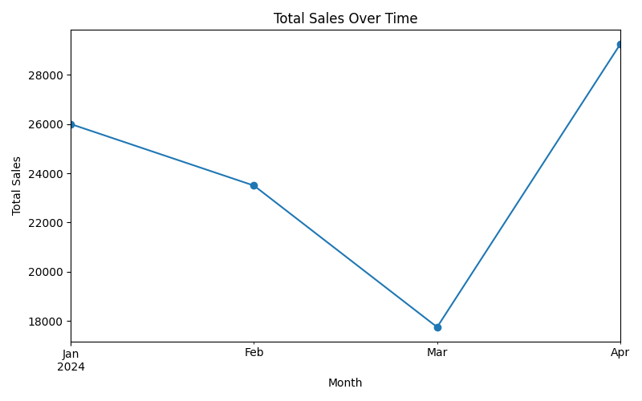

# ETL Lab Project

## 1. Project Overview

This project demonstrates a full ETL (Extract, Transform, Load) pipeline for order and transaction data using Python. The workflow showcases best practices in data preparation and analytics, including data cleaning, transformation, efficient storage, and business insight generation through visualization. Each step is modular and reproducible, making the process easy to follow and adapt to new data sources.

---

## 2. ETL Phases

### Extraction

- **Source:** Raw CSV files containing order and customer data.
- **Process:** Data is loaded using pandas, with inspection of schema and initial data profiling to understand structure and potential quality issues.

### Transformation

- **Cleaning:** Handling missing values, correcting data types, and fixing inconsistencies.
- **Normalization:** Standardizing categorical fields and date formats.
- **Feature Engineering:** Calculating new values such as total order amount.
- **Validation:** Ensuring business rules are met and data integrity is maintained.

### Load

- **Storage:** The cleaned and transformed data is saved in Parquet format within the `loaded/` directory for optimized analytics workflows.
- **Verification:** Data previews are shown to confirm the load was successful.

### Visualization (or Unique Transformation)

- **Visualization:** Business insights are communicated with charts such as "Order Counts by Region" and "Total Sales Over Time," generated using matplotlib.

---

## 3. Tools Used

- **Python 3.x**
- **pandas** (data handling)
- **matplotlib** (visualization)
- **pyarrow** (for Parquet)
- **Jupyter Notebook** or **VS Code**
- **Git & GitHub**

---

## 4. How to Run the Project

### Prerequisites

- Python 3.8 or higher
- Jupyter Notebook or VS Code (recommended)

### Installation

```bash
git clone https://github.com/[your-username]/[your-repo].git
cd [your-repo]
pip install -r requirements.txt
```

Sample `requirements.txt`:
```
pandas
pyarrow
matplotlib
seaborn
jupyter
```

### Running the ETL Pipeline

1. **Open the Notebooks:**
   - Use Jupyter or VS Code.
   - Run cells in this order:
     - `1_extract.ipynb`
     - `2_transform.ipynb`
     - `3_load.ipynb`
     - `4_visualization.ipynb`

2. **Check Outputs:**
   - Processed data is written to the `loaded/` folder.
   - Visualizations and previews are shown in the notebooks and saved as images in `loaded/`.

3. **Preview Loaded Data:**
   ```python
   import pandas as pd
   print(pd.read_parquet("loaded/full_data.parquet").head())
   ```

---

## 5. Project Structure

```
├── data/                # Raw CSV files
├── transformed/         # Cleaned data (optional)
├── loaded/              # Final data (Parquet) and visualization images
├── notebooks/           # Jupyter notebooks for each ETL phase
├── requirements.txt     # Dependencies
├── README.md            # This documentation
```

---

## 6. Visualization

**Order Counts by Region:**


**Total Sales Over Time:**



---

## 7. Key Features

- **Clear notebook per ETL phase:** Each step is separated for clarity.
- **Efficient Parquet storage:** Fast, scalable analytics-ready format.
- **Data quality checks:** Cleaning and validation in transformation phase.
- **Business insights:** Automated plots and summaries for quick understanding.
- **Well-documented:** Each part of the process is explained in code and markdown.

---

## 8. License

This project is licensed under the MIT License.

---

## 9. Contact

For questions or collaboration, please raise a GitHub Issue or email [muthoninduta@gmail.com].
